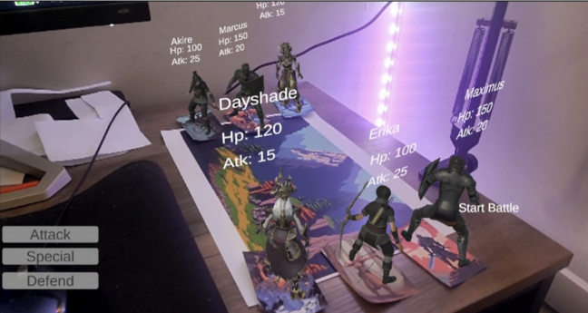
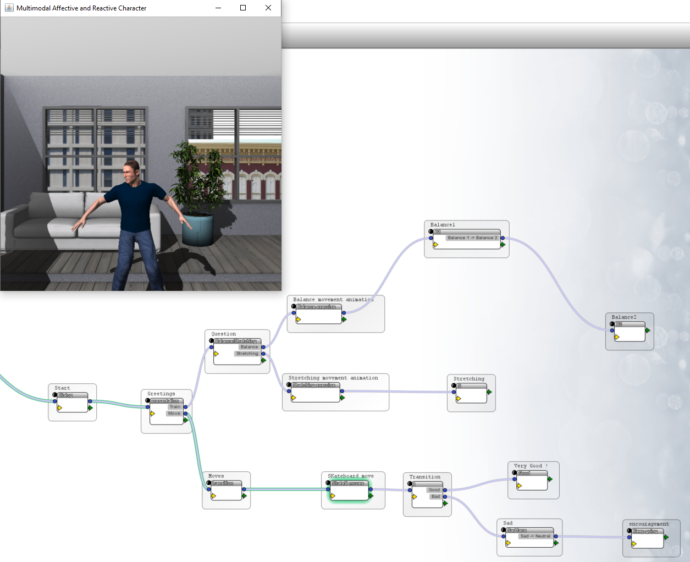

# PORTFOLIO
Hi ! My name is Baptiste SAMOYAULT and welcome on my Portfolio. 
I am in M2 Human-Computer-Interaction. I have a passion for design and coding. 

How to reach me:  
Phone number: 0652405626  
email: bsamoyault@gmail.com  

## My CV:

## Master Human-Computer-Interaction:

### Object Programming project

#### Maze-Project (object programming) in Java:
**Team of 2 peoples.**  
**Link**: https://github.com/BaptisteSamoyault/The-Maze-Project
**Description**: We created a game where a player needs to escape a maze, the player is tailed by an AI ennemy.  
More information here   
How to test it 

#### Sub'n Mines (object programming) in Java:
**Solo project**.  
**Link**: https://github.com/BaptisteSamoyault/sub-n-mines  
**Description**: This a game inspired by the minesweeper game. The player control a submarine and need to reach a target while avoiding invisble mines. 

### Web Devellopement project

#### Web Project, a Discord Clone in Javascript, CSS:
**Team of 2 peoples**  
**Link** to my part (Frontend): https://github.com/dnguye12/Discord-Frontend  
**Link** to my coworker part (Backend): https://github.com/dnguye12/Discord-Backend  
**Link for the render**: https://discord-backend-tlyr.onrender.com/  
**Description**: This project is an attempt to recreate the application Discord and its functionnalities, from creating a server to video calls.  

#### Binge Buddies (Web Programming) in Javascript, CSS:
**Team of 5 peoples**  
**Description**: Our idea was to make a web application for friends afar from each others to watch movies together. We conducted interviews on people about their preferences on watching movies with friends, from there we did our best to answer to every worries they had. And so we created "Binge Buddies".  
Full paper about the application:   
Presentation :   
Video: https://www.youtube.com/watch?v=EW28VevIyIQ  

### Virtual Reality AND/OR Augmented Reality project

#### Bow project (Unity, VR) in C##:
**Team of 2 peoples**.  
**Description**: We made on Unity a VR project where user can grab a bow and shoots arrows at targets. We use Vive Cosmos helmet and 2 controllers for the hands.  
**Video**: 
Presentation: 

#### Science Fair project on Unity (Unity, VR) in C#:
**Team of 2 peoples**.  
**Link**: https://github.com/RabiiAlaouiLamharzi/final-project-unity  
**Description**: We created on Unity a science fair for a VR Project, we used a PicoXR headset. Using a remote you can activate our experiment. On the demonstration video, you will see our 3 exhibits: the Volcano, the Lamp, and the Magnet.

#### AR Card game project "Arcane Rivals" (Unity, Vuforia, AR) in C#:
**Team of 3 peoples**.  
**Link**: https://github.com/barfran/CardGame/tree/main/Game  
**Description**: We created a AR Card game, using Unity and Vuforia to store our assets. When a card is detected by the camera of a phone, on the top of it, a character will appear and if 2 cards are close to each other, a fight will begin. Characters are animated.  
  
**Video**: https://youtu.be/9nzZ5zxSYwo  

### Design project

#### Lil'Bot, an Augmented Reality & Previsualization project (Blender, Davinci Resolve):
**Solo Project**.  
**Description**: I created on Blender a simili of an AR application. Using (fake) AR glasses a user can have a robot companion. I think of the robot to incline people to try new things and doing good deeds and rewading them for those actions. I used Blender to create the robot, made the animation by hands. As for it's emplacement in space, motion tracking was used.  
**Link to video**: https://youtu.be/FxAa9C57NDQ  

#### A virtual coach using MARC (a Paris-Saclay appplication):
**Team of 3 peoples**.
  
**Link**:   
**Description**: We created a virtual coach to help people train for sketboarding. We used several studies to make this virtual human. We used a software called MARC to design the facials and bodies animations.   
Watch more here ->   

#### 3D object Design and Printing "French Lantern":
**Solo project**  
**Link**:   
**Description**: I had to make a 1m² object using 3D printed objects. I decided to build my lantern using blue, white, and red octagonal surfaces. Then, using connectors, I was able to attach them together.  
**Photo**: 

#### Echo Guide:
**Team of 4 peoples**  
**Description**: We designed a tool to help people navigating. A tool indicating how to reach your destination, warning you about problems ahead on the way.  
**Presentation**: 
**Video**: https://youtu.be/TQCjjoRbKsk  
**Poster**:   

#### Designing a Template system for presentation, "Better Templates":
**Team of 4 peoples**.  
**Description**: As students we encountered difficulties to make good visuals for our presentation and to prepare them. So we wanted to create a better way to create presentation. After conducting interviews we came up with various ideas on how we can ease the process of creating a presentation, like personalized templates, AI help to prepare the talking parts,...  
**Video**: 

## Bachelor of Computer Science:

### Object Programming project:

#### Frogger (object programming) in Java: 
**Team of 2 peoples**.  
**Link**: https://github.com/PierreDerathe/projetFroggerDeratheSamoyault
**Description**: We made our own version of the world famous game "Froger" using java.

#### Forbidden Island (object programming) in Java:
**Team of 2 peoples**.
Link : https://github.com/Julien-LG/Projet-Ile-Interdite
Description: We implemented our own version of the game named "Forbidden Island" using java. 

#### Wotah (object programming) in Java:
**Team of 4 peoples**.
**Link**: https://github.com/Julien-LG/Wotah  
**Description**: We developped a game name "Wotah" by taking inspiration from "StarCraft" and "Tropico" using java.
**Slides presentation** (in French): 

### Web Devellopement project:

#### Calendar project (Web programming) in HTML, CSS and Javascript:
**Team of 2 peoples**.  
**Link**: https://github.com/Sebastien-Sch/ProgWebProject2023  
**Description**: We implemented a web university's calendar. Depending on who's login, certains fonctionnalities are on, a teacher can add a class to the calendar and a student can visit the calendar to see what class he/she has.
